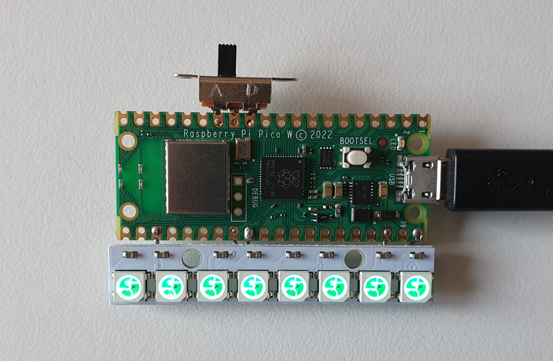
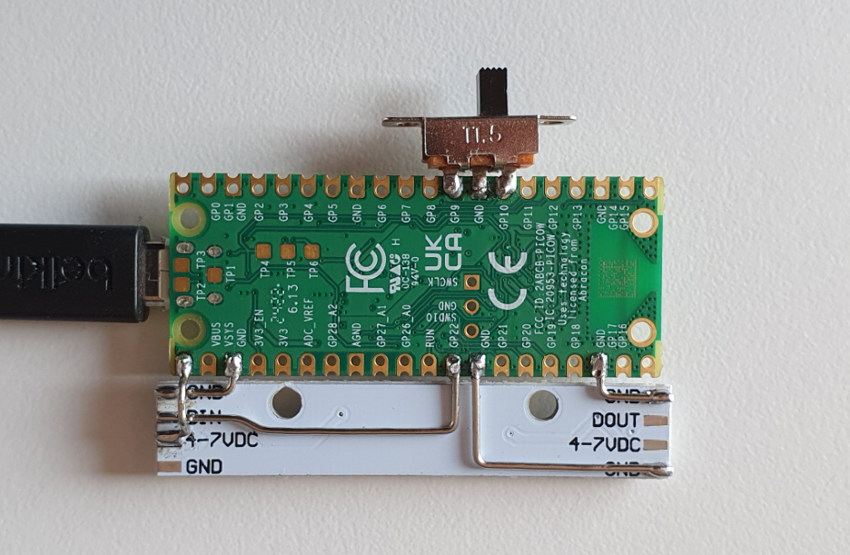

# Wake light

## Idea

A night light that:

 - Red: Acts as a nearly invisible night light.
 - Orange: It's okay to get up (albeit earlier than normal).
 - Green: You probably should have gotten up.

The point is to avoid looking at the actual time (which is a terrible sleep
habit), but still be able to know if you could/should get up.

## Hardware

 - Raspberry Pi Pico W.
 - Generic 8-LED light strip (NeoPixel WS2812 compatible).
 - Switch (for daylight savings).
